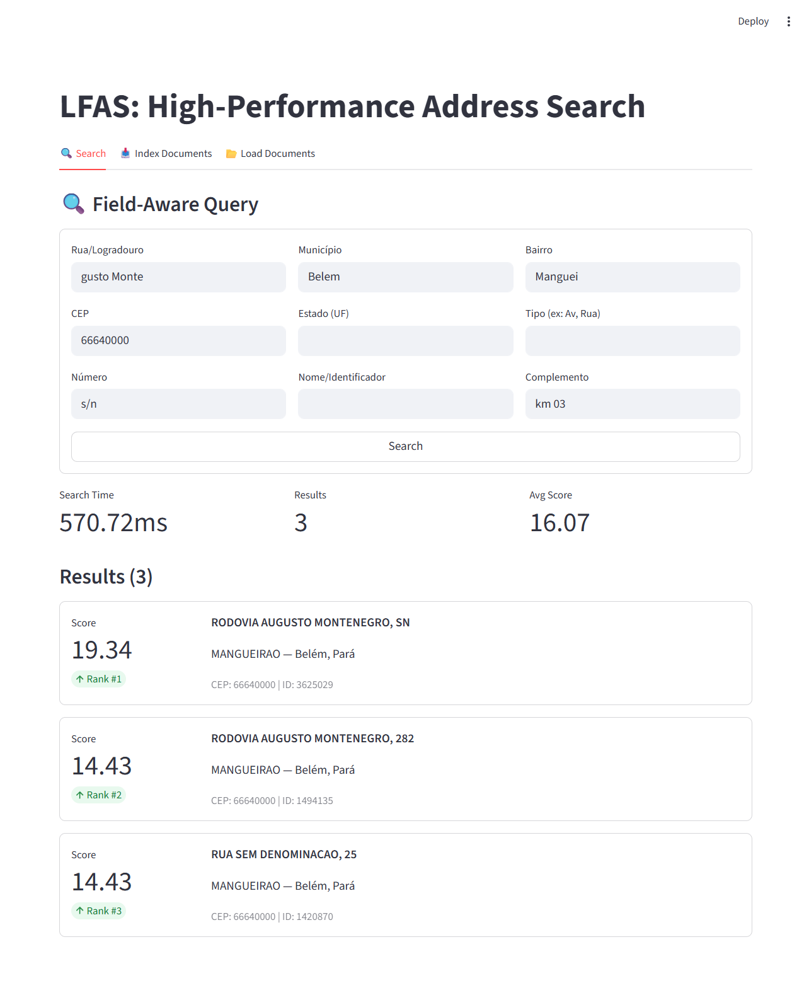

# LFAS - Lightning Fast Address Search

[](https://www.rust-lang.org/)
[](https://www.python.org/)
[](LICENSE)
[]()

High-performance address search engine designed for fuzzy matching and partial queries. Built with Rust for speed and efficiency, with Python bindings for easy integration.

## Overview

LFAS implements a two-stage retrieval architecture inspired by the approach described in ["Efficient Query Evaluation using a Two-Level Retrieval Process"](https://arxiv.org/abs/1708.01402) (Crane et al., 2017). The system uses distinctive tokens for candidate selection and comprehensive token matching for ranking.

For a detailed explanation of the implementation and design decisions (in Portuguese), see the blog post: ["Como tornar buscas de endereços rápidas e precisas"](https://maikerar.substack.com/p/como-tornar-buscas-de-enderecos-rapidas).

## Preview



## Features

- **Fuzzy Search**: Handles typos and partial address descriptions
- **Field-Aware Indexing**: Optimized for structured address data (street, city, state, ZIP, etc.)
- **BM25F Scoring**: Advanced relevance ranking with field-specific weights
- **Persistent Storage**: LMDB-backed index for fast disk I/O
- **High Throughput**: Batch indexing at 100K+ docs/sec
- **Low Latency**: Sub-100ms query response times
- **Token Strategies**: Distinctive tokens for candidate filtering, weak tokens (n-grams) for scoring

## Architecture

```
┌─────────────────┐
│  Streamlit UI   │
└────────┬────────┘
         │
    ┌────▼─────┐
    │ Python   │
    │ Bindings │
    └────┬─────┘
         │
    ┌────▼──────────────────────────────┐
    │      Rust Core Engine             │
    ├───────────────────────────────────┤
    │  Tokenizer → Index → Scorer       │
    │  - N-grams & Phrases              │
    │  - Inverted Index (LMDB)          │
    │  - BM25F Ranking                  │
    └───────────────────────────────────┘
```

## Quick Start

### Prerequisites

- Rust 1.70+
- Python 3.13+
- Make

### Installation

```bash
# Clone repository
git clone <repository-url>
cd lfas

# Build Rust library and install Python bindings
make develop

# Install Python dependencies
uv sync
```

### Building 

```bash
# Activate env
source .venv/bin/activate

make develop
```

### Running the Application

```bash
streamlit run app.py
```

Access the web interface at `http://localhost:8501`

## Usage

### 1. Index Documents

Upload a CSV file with address data. Required columns:
- `rua` (street)
- `municipio` (city)
- `estado` (state)
- `cep` (ZIP code)
- `bairro` (neighborhood)
- `tipo_logradouro` (street type)
- `numero` (number)
- `complemento` (complement)
- `nome` (name/identifier)

### 2. Search Addresses

Perform field-aware queries:

```python
from lfas import PySearchEngine

engine = PySearchEngine()
engine.load_metadata("./lmdb_data/metadata.bin")

results = engine.search_complex(
    query_dict={
        "rua": "Mauriti",
        "municipio": "Belem",
        "numero": "31"
    },
    top_k=10,
    blocking_k=1000
)

for doc_id, score in results:
    print(f"Document {doc_id}: {score:.2f}")
```

## Tokenization Strategy

### Distinctive Tokens (Candidate Filtering)
- CEP patterns: `66095-000`
- House numbers: `31`, `500`
- State abbreviations: `PA`, `MA`
- N-grams with address types: `rua 123`, `br 010`

### Weak Tokens (Scoring Only)
- 3-character n-grams from all tokens
- Improves recall for partial matches

### Example
Input: `"Travessa Mauriti 31 Belém PA"`

**Distinctive**: `["31", "pa", "66095-000", "travessa 31"]`  
**All**: `["travessa", "mauriti", "31", "belem", "pa", "mau", "uri", "iti", ...]`

## Performance

### Indexing
- **Throughput**: ~9,000+ docs/sec
- **Storage**: ~500 bytes per document (compressed)

### Search
- **Latency**: <200ms for most queries

### Benchmark Results

```
$ cargo bench --bench search_benchmark

single_field_rare_term     time: [~145 us]
multi_field_common_terms   time: [~295 us]
```

## Development

### Build & Test

```bash
# Run tests
make test

# Run benchmarks
make bench

# Lint code
make check

# Build release
make release
```

### Benchmark Suite

```bash
# Index performance
cargo bench --bench index_benchmark

# Search performance
cargo bench --bench search_benchmark

# Tokenizer performance
cargo bench --bench tokenizer_benchmark

# Storage I/O
cargo bench --bench persistance_benchmark

# Concurrency
cargo bench --bench concurrency_benchmark
```

## Configuration

### BM25F Parameters

Edit field weights in `src/python.rs`:

```rust
let mut field_weights = HashMap::new();
field_weights.insert(RecordField::Cep, 5.0);    // Highest priority
field_weights.insert(RecordField::Rua, 2.0);
field_weights.insert(RecordField::Municipio, 1.0);
```

### LMDB Settings

Adjust in `src/storage/lmdb.rs`:

```rust
pub const BATCH_SIZE: usize = 100_000;  // Batch write size
pub const MAP_SIZE: usize = 10 * 1024 * 1024 * 1024;  // 10GB
```

## Technical Details

### Two-Round Search

1. **Round 1 - Candidate Retrieval**: Use distinctive tokens to find potential matches (union operation)
2. **Round 2 - Ranking**: Score all candidates using BM25F with all tokens (including weak tokens)

### Storage Backend

- **Primary**: LMDB (Lightning Memory-Mapped Database)
- **Batch writes**: 100K buffer for write optimization
- **Transaction reuse**: Single read transaction for batch operations
- **Fallback**: In-memory storage for testing

## Project Structure

```
lfas/
├── src/
│   ├── engine.rs       # Search engine core logic
│   ├── index.rs        # Inverted index implementation
│   ├── lib.rs          
│   ├── metadata.rs     # Document statistics
│   ├── postings.rs     # Posting lists (bitmaps + frequencies)
│   ├── python.rs       # PyO3 bindings
│   ├── scorer.rs       # BM25F ranking algorithm
│   ├── timing.rs       # Performance instrumentation
│   ├── tokenizer.rs    # Text processing & n-grams
│   └── storage/        # LMDB & in-memory backends
│       ├── lmdb.rs
│       ├── memory.rs
│       └── mod.rs
├── benches/            # Criterion benchmarks
├── tests/              # Integration tests
├── app.py              # Streamlit web interface
└── Cargo.toml
```

## Contributing

1. Fork the repository
2. Create a feature branch (`git checkout -b feature/improvement`)
3. Commit changes (`git commit -am 'Add feature'`)
4. Push to branch (`git push origin feature/improvement`)
5. Open a Pull Request

## License

MIT License - see [LICENSE](LICENSE) file for details

## Acknowledgments

- Built with [Rust](https://www.rust-lang.org/) and [PyO3](https://pyo3.rs/)
- Uses [LMDB](http://www.lmdb.tech/) for persistent storage
- UI powered by [Streamlit](https://streamlit.io/)
- Benchmarking with [Criterion.rs](https://github.com/bheisler/criterion.rs)

## References

Crane, M., Trotman, A., & O'Keefe, R. (2017). *Efficient Query Evaluation using a Two-Level Retrieval Process*. arXiv preprint arXiv:1708.01402. https://arxiv.org/abs/1708.01402

Reis, M. (2025). *Como tornar buscas de endereços rápidas e precisas: Soluções para tratar endereços complexos sem depender de especialistas*. Substack. https://maikerar.substack.com/p/como-tornar-buscas-de-enderecos-rapidas

---

**Note**: This project is optimized for Brazilian address data but can be adapted for other address formats by modifying the tokenizer rules in `src/tokenizer.rs`.
